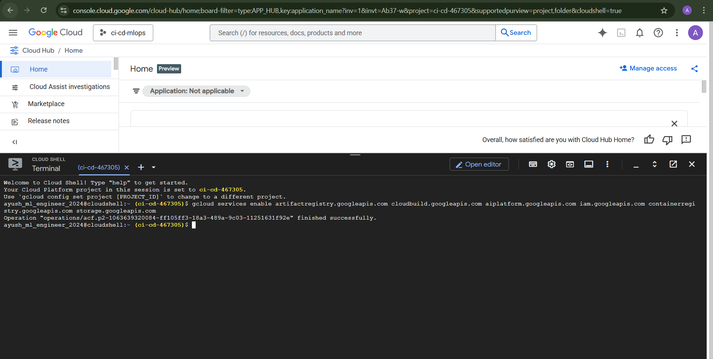
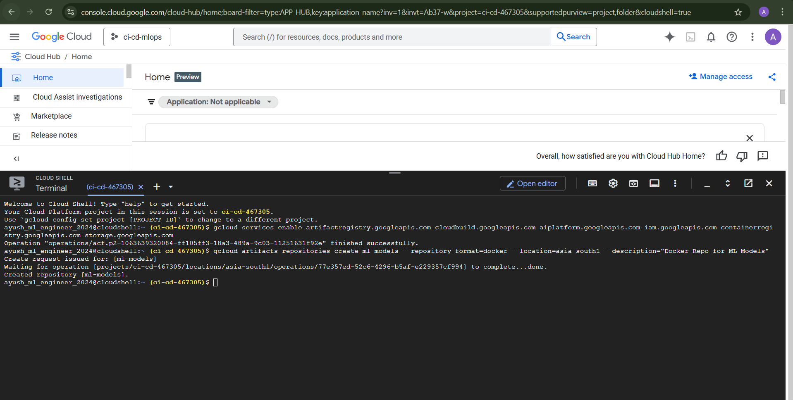
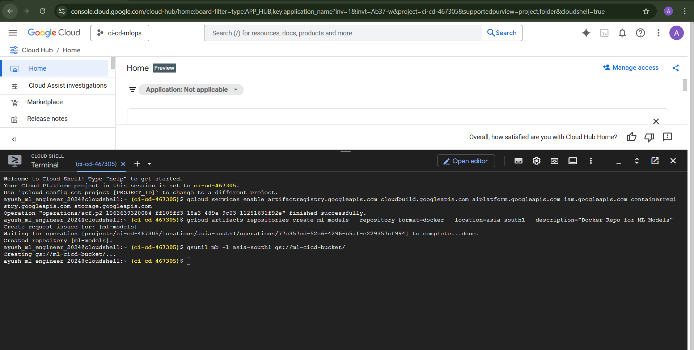
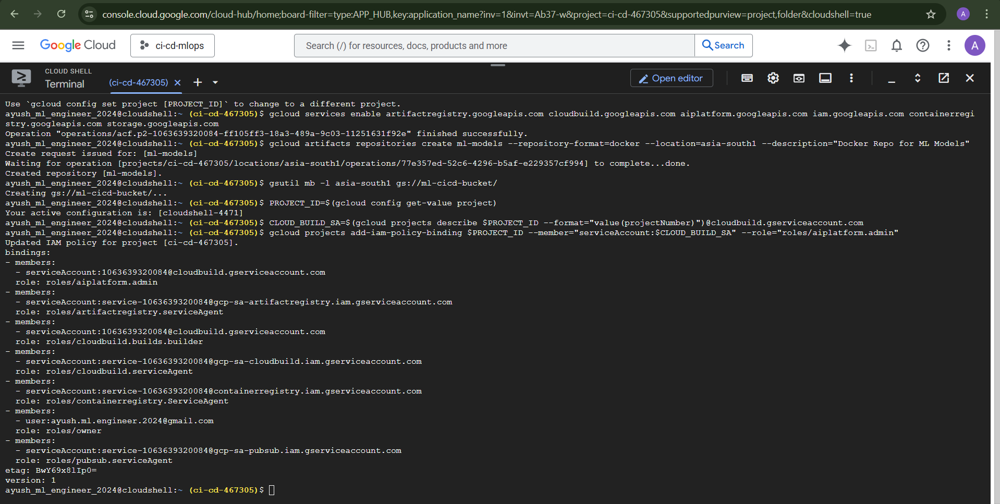
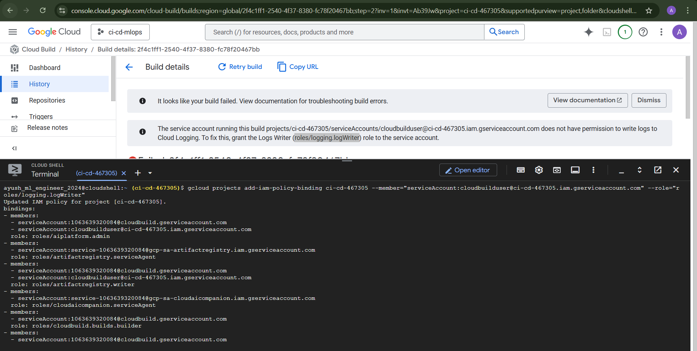
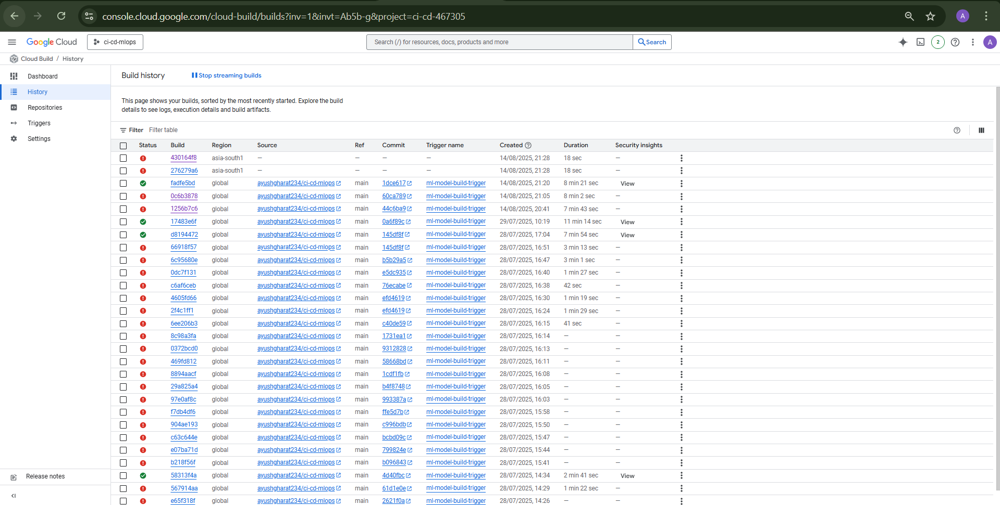
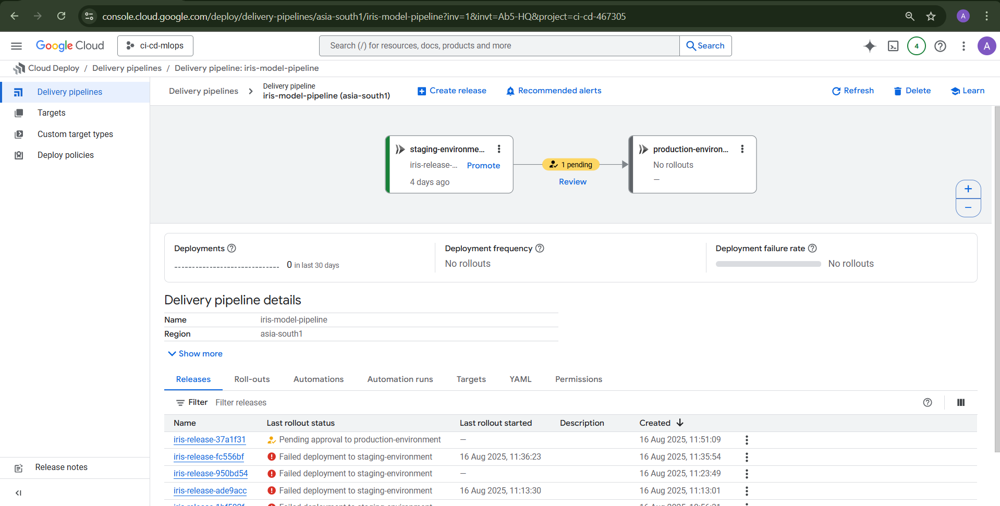
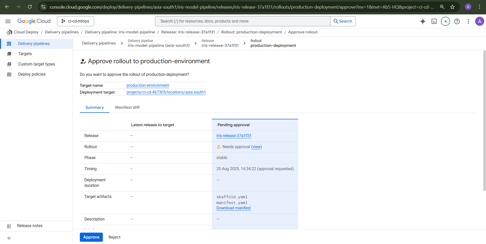
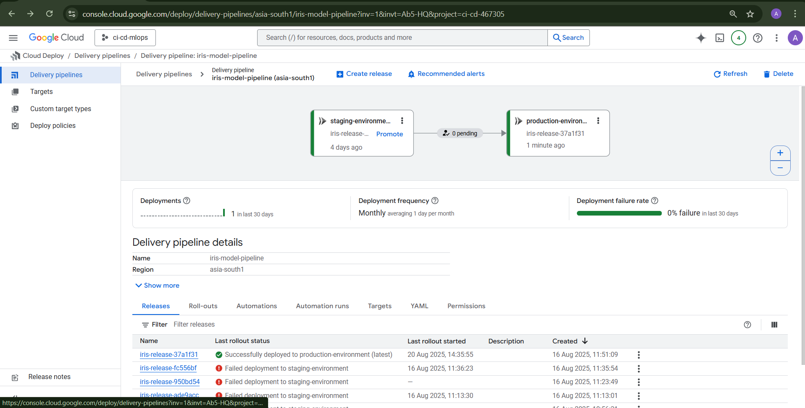

# End-to-End MLOps: Automated Training & Deployment on Google Cloud

[](https://cloud.google.com/)
[](https://cloud.google.com/vertex-ai)
[](https://cloud.google.com/build)
[](https://cloud.google.com/deploy)
[](https://www.docker.com/)

Welcome! This repository demonstrates a production-grade **MLOps pipeline** on Google Cloud Platform (GCP). It showcases a fully automated workflow that takes a machine learning model from source code to a versioned, deployable artifact in Vertex AI.

This project moves beyond notebooks and manual scripts. It's a real-world implementation of how to apply DevOps principles to the machine learning lifecycle, including automated training, containerization, artifact management, and a structured continuous delivery process.

---

## Table of Contents

* [Project Overview](#-project-overview)
* [MLOps Workflow](#-mlops-workflow)
  * [Detailed Pipeline Breakdown](#detailed-pipeline-breakdown)
* [Visual Showcase](#-visual-showcase)
* [Key Features](#-key-features)
* [Technology Stack](#-technology-stack)
* [Getting Started](#-getting-started)
  * [Prerequisites](#prerequisites)
  * [Configuration](#configuration)
  * [Triggering the Pipeline](#triggering-the-pipeline)
* [Project Structure](#-project-structure)
* [Conclusion & Future Scope](#-conclusion--future-scope)
* [Cleanup](#-cleanup)

---

## Project Overview

The core objective is to automate the entire lifecycle of ML Models (used `Iris Classifier` for example usecase). When a data scientist or ML engineer pushes new code to the repository, a **Google Cloud Build** pipeline is automatically triggered. This pipeline handles every step required to produce a production-ready model.

This MLOps approach ensures:
* **Reproducibility**: Every model is built and trained in a consistent, containerized environment.
* **Traceability**: Model versions in Vertex AI are directly linked to the source code commit (`$SHORT_SHA`) that produced them.
* **Automation**: Eliminates manual, error-prone steps, enabling rapid and reliable iteration.
* **Scalability**: Leverages managed GCP services that scale on demand.

---

## MLOps Workflow

The pipeline, defined in `cloudbuild.yaml`, orchestrates a sequence of automated steps that embody MLOps best practices. The entire process is triggered by a single `git push`.

1. **Code Push**: Push changes (e.g., `train.py` or `Dockerfile`) to the `main` branch of the repository.
2. **CI/CD Trigger**: Google Cloud Build detects the push and initiates a build.
3. **Build & Push Container Image**: Cloud Build builds a Docker image from the `Dockerfile`, tags it with `$SHORT_SHA`, and pushes it to **Artifact Registry**.
4. **Execute Model Training**: The container runs the `train.py` script to train the model and save `model.joblib`.
5. **Store Model Artifact**: The trained model is uploaded to a versioned path in a **GCS bucket**.
6. **Register Model in Vertex AI**: The model is registered in **Vertex AI Model Registry** with links to the container and GCS artifact.
7. **Trigger Continuous Delivery**: A release is created in **Cloud Deploy**, rolling out the model to staging and production environments.

---

### Detailed Pipeline Breakdown

Each step in `cloudbuild.yaml` has a clear purpose:

1. **Build & Push Image**
```bash
gcloud builds submit --tag asia-south1-docker.pkg.dev/PROJECT_ID/ml-models/iris-classifier:$SHORT_SHA
```

2. **Train Model in Ephemeral Job**
```bash
docker run asia-south1-docker.pkg.dev/PROJECT_ID/ml-models/iris-classifier:$SHORT_SHA python train.py
```

3. **Store Model Artifact in GCS**
```bash
gsutil cp model/model.joblib gs://ml-cicd-bucket/models/$SHORT_SHA/model.joblib
```

4. **Register Model in Vertex AI**
```bash
gcloud ai models upload \
  --region=asia-south1 \
  --display-name=iris-classifier \
  --container-image-uri=asia-south1-docker.pkg.dev/PROJECT_ID/ml-models/iris-classifier:$SHORT_SHA \
  --artifact-uri=gs://ml-cicd-bucket/models/$SHORT_SHA/
```

5. **Create Cloud Deploy Release**
```bash
gcloud deploy releases create rel-$SHORT_SHA \
  --project=PROJECT_ID \
  --region=asia-south1 \
  --delivery-pipeline=ml-deploy-pipeline \
  --images=iris-classifier=asia-south1-docker.pkg.dev/PROJECT_ID/ml-models/iris-classifier:$SHORT_SHA
```

---

## Visual Showcase

### 1️⃣ Enabling APIs


### 2️⃣ Creating Artifact Registry for Images


### 3️⃣ Creating GCS Bucket for Logs & Artifacts


### 4️⃣ Creating Service Account for CI/CD


### 5️⃣ Granting Deploy Permissions to Service Account


### 6️⃣ Cloud Build Triggers


### 7️⃣ Automatic Deployment to Cloud Deploy


### 8️⃣ Approval for Production Deployment


### 9️⃣ Deployment Completion in Production


---

## Challenges Faced

* **IAM Permissions**: Assigning correct roles to the Cloud Build service account.
* **Bucket Naming**: GCS buckets need globally unique names.
* **Training & Serving Consistency**: Dockerfile + requirements.txt were key.
* **Debugging Cloud Build**: Required using `--verbosity=debug` for detailed logs.

---

## Key Features

- Automated CI/CD from `git push` to production model.
- Containerized training with Docker.
- Centralized artifact management (Artifact Registry + GCS).
- Unified model governance in Vertex AI.
- Safe continuous delivery with Cloud Deploy.
- GitOps workflow with traceability.

---

## Technology Stack

| Technology             | Purpose                                           |
| ---------------------- | ------------------------------------------------- |
| **Google Cloud**       | Cloud provider                                    |
| ┣ **Cloud Build**      | CI/CD orchestration                               |
| ┣ **Artifact Registry**| Store Docker images                               |
| ┣ **Cloud Storage**    | Store trained model artifacts                     |
| ┣ **Vertex AI**        | Model registry & deployment hub                   |
| ┣ **Cloud Deploy**     | Model delivery pipeline                           |
| **Docker**             | Containerization                                 |
| **Python**             | Model training (`train.py`)                       |
| **GitHub**             | Version control                                   |

---

## Getting Started

### Prerequisites

1. **Google Cloud Project** with billing enabled.
2. Install **gcloud CLI**.
3. Enable required APIs:
```bash
gcloud services enable cloudbuild.googleapis.com artifactregistry.googleapis.com aiplatform.googleapis.com clouddeploy.googleapis.com storage.googleapis.com
```
---

### Configuration

1. **Clone Repo**
```bash
git clone https://github.com/your-username/ci-cd-mlops.git
cd ci-cd-mlops
```

2. **Create GCS Bucket**
```bash
gsutil mb -l asia-south1 gs://ml-cicd-bucket
```

3. **Create Artifact Registry**
```bash
gcloud artifacts repositories create ml-models \
  --repository-format=docker \
  --location=asia-south1 \
  --description="Docker repo for ML models"
```

4. **Grant IAM Roles to Cloud Build**
```bash
PROJECT=$(gcloud config get-value project)
PROJECT_NUMBER=$(gcloud projects describe $PROJECT --format="value(projectNumber)")
SA="${PROJECT_NUMBER}@cloudbuild.gserviceaccount.com"

gcloud projects add-iam-policy-binding $PROJECT --member="serviceAccount:$SA" --role="roles/storage.admin"
gcloud projects add-iam-policy-binding $PROJECT --member="serviceAccount:$SA" --role="roles/aiplatform.user"
gcloud projects add-iam-policy-binding $PROJECT --member="serviceAccount:$SA" --role="roles/artifactregistry.writer"
gcloud projects add-iam-policy-binding $PROJECT --member="serviceAccount:$SA" --role="roles/clouddeploy.releaser"
```

5. **Create Build Trigger**
- Go to **Cloud Build > Triggers**.
- Connect GitHub repo.
- Trigger on push to `main`.
- Use `/cloudbuild.yaml` as config file.

---

### Triggering Pipeline

```bash
git commit -m "feat: update training logic"
git push origin main
```

Monitor pipeline in **Cloud Build Console**.

---

## Project Structure

```
├── cloudbuild.yaml         # Pipeline definition
├── clouddeploy.yaml        # Cloud Deploy pipeline
├── cloudrun-service.yaml   # Cloud Run service config
├── skaffold.yaml           # Optional dev workflow
├── Dockerfile              # Training container
├── serve.py                # Model serving code
├── model/                  # Model artifacts
├── endpoints/              # Serving endpoints
├── screenshots/            # Workflow screenshots
├── README.md               # Documentation
```

---

## Cleanup

```bash
gcloud builds triggers delete TRIGGER_NAME

gcloud ai models delete iris-classifier --region=asia-south1

gcloud deploy delivery-pipelines delete ml-deploy-pipeline --region=asia-south1

gcloud artifacts repositories delete ml-models --location=asia-south1

gsutil rm -r gs://ml-cicd-bucket
```

---

## Conclusion & Future Scope

This project demonstrates a **production-ready CI/CD + MLOps workflow** on Google Cloud. Future improvements can include:
- Canary & blue-green rollouts for ML models.
- Automated evaluation metrics and validation before deployment.
- Integration with monitoring & alerting (e.g., Cloud Monitoring).
- Multi-environment pipelines (dev → staging → prod).

